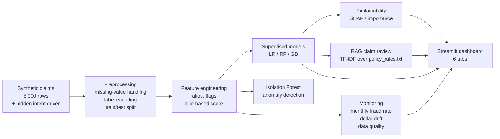

# Insurance FWA Risk Scoring & GenAI Claims Review System

> An end-to-end Fraud, Waste & Abuse (FWA) analytics portfolio aligned to the
> **Associate Data Scientist — Long Term Care FWA Advanced Analytics** role at
> Manulife / John Hancock. ML risk scoring + RAG-style claim review + model
> monitoring + an analyst-facing Streamlit dashboard.

[](https://python.org)
[](https://scikit-learn.org)
[](https://streamlit.io)

---

## Project Overview

A complete, leakage-aware FWA pipeline that runs on synthetic data:

- Generate ~5,000 synthetic claims with **hidden latent drivers** (provider
  integrity, policyholder intent) so the label is non-trivial to recover.
- Engineer realistic claim-level features (amount-vs-provider-average,
  documentation completeness, duplicate / late flags, new-policy flag).
- Train Logistic Regression, Random Forest, and Gradient Boosting; evaluate
  with ROC, PR, and a full threshold sweep.
- Layer on an **Isolation Forest** anomaly detector and an explainability
  module (SHAP-or-fallback feature importance + per-claim explanations).
- Serve a TF-IDF based **RAG claim review** that produces analyst-ready
  packets (risk indicators, retrieved policy evidence, documentation gaps,
  suggested action, human review notes, limitations).
- Add a **monitoring module** for monthly fraud rate, dollar drift, and
  column-level data quality.
- Wrap everything in a **6-tab Streamlit dashboard** for executives and
  analysts.

---

## Business Problem

> "How do we catch fraud, waste, and abuse in Long Term Care claims early —
> while protecting reviewer capacity and provider trust — and do it in a way
> that is auditable and explainable to compliance and regulators?"

Long Term Care is particularly exposed: claims involve home-health agencies,
overlapping caregiver shifts, multi-year benefit periods, and cognitive-impairment
determinations that are hard to verify after the fact. Catching FWA late means
recovery is expensive or impossible.

---

## Why FWA Analytics Matters (Long Term Care Context)

- The NHCAA estimates U.S. healthcare fraud at **$68B-$300B per year**.
- LTC-specific FWA patterns include: duplicate caregiver billing, phantom
  home-health visits, upcoded ADL deficits, and unverified plan-of-care
  signatures.
- A good FWA system pairs **statistical scoring** (to triage at volume) with
  **human-in-the-loop review** (for adjudication and appeals), and supports
  every decision with **audit-grade documentation**.

This project demonstrates that pairing end-to-end on a realistic synthetic
proxy of LTC-style claims.

---

## Solution Architecture



---

## Data Disclaimer

**All data is synthetically generated** with NumPy. No PHI / PII / real claims
are used or referenced. Provider IDs, policyholder IDs, claim narratives, and
the policy-rules corpus are all fabricated for portfolio demonstration. Nothing
in this repository should be used to score or evaluate any real claim or
provider.

---

## ML Modeling Approach

- **Target:** binary `fraud_label` (~13% prevalence).
- **Features (22 used by the model):** claim_amount, approved_amount,
  ratios, documentation_score, suspicious_keyword_count, duplicate_claim_flag,
  late_submission_flag, prior_claim_count, provider_claim_volume,
  provider_avg_claim_amount, claimant_age, days_since_policy_start,
  encoded service_type / diagnosis_group / state, plus engineered flags.
- **Excluded by design:** the hand-coded `rule_based_risk_score` (kept only
  as a transparent dashboard baseline), `provider_integrity` and
  `policyholder_propensity` (intentionally hidden latent drivers), and any
  feature that would be a direct function of the label.
- **Imbalance handling:** `class_weight='balanced'` for LR/RF;
  `scale_pos_weight` for XGBoost when available.
- **Evaluation:** ROC-AUC, precision, recall, F1, plus a full
  threshold sweep so operations can pick the precision/recall tradeoff that
  matches their reviewer capacity.

### Latest test-set metrics

| Model              | ROC-AUC | Precision | Recall | F1   |
|--------------------|--------:|----------:|-------:|-----:|
| LogisticRegression | 0.817   | 0.353     | 0.701  | 0.469 |
| RandomForest       | 0.824   | 0.640     | 0.402  | 0.493 |
| GradientBoosting   | 0.812   | 0.618     | 0.402  | 0.487 |

---

## Why the Model Metrics Are Interpreted Carefully

Synthetic data makes it easy to accidentally build a model that scores very
high simply because the label is a function of the same features the model
sees — that's **target leakage**, and it would be the first thing a senior
reviewer flagged.

A previous iteration of this project showed ROC-AUC ~0.99 and F1 ~0.96. After
audit we found three leakage paths:

1. `claim_amount` was deterministically inflated by the fraud label, then
   used as a feature.
2. `approved_amount` was conditioned on the fraud label.
3. `high_cost_outlier_flag` was a near-deterministic re-encoding of (1).

The current version fixes all three:

- A **hidden intent variable** (driven by provider integrity and policyholder
  propensity, neither of which is exposed to the model) is the dominant
  driver of the label.
- **Documentation score, suspicious keyword count, and duplicate flag** are
  generated as *noisy proxies* of intent — informative, but far from
  deterministic.
- Claim-amount inflation from intent is small and overlaps heavily with
  legitimate high-cost claims (inpatient, oncology).
- The label is stochastic: ~2-3% of low-risk claims still become fraud, and
  ~10% of high-risk claims look subtle enough to slip through.
- `high_cost_outlier_flag` was retired; `approved_amount` is now a function
  of observed features (docs, amount ratio, duplicate flag) plus noise — the
  same way an adjuster would actually decide.

The resulting metrics (AUC ~0.82, F1 ~0.49) are deliberately realistic for
this kind of problem. Real-world LTC fraud detection typically lands in
**AUC 0.75-0.90** territory with comparable feature sets, and the
precision/recall point depends on operational appetite.

---

## GenAI / RAG Claims Review

For each claim, the RAG module:

1. Builds a TF-IDF index over the policy-rules corpus (`policy_rules.txt`).
2. Constructs a natural-language query from the claim's flagged risk signals.
3. Retrieves the top-3 most relevant policy chunks.
4. Renders an **analyst-ready review packet** with:
   - Claim ID, Risk Level, Model Risk Score
   - Key Risk Indicators (quantified)
   - Retrieved Policy Evidence (with similarity scores)
   - Documentation Gaps specific to this claim
   - Suggested Analyst Action
   - Human Review Notes (what an analyst should verify)
   - Limitations (synthetic data + model uncertainty)

The retrieval and rendering are fully deterministic and require no external
APIs. In production, this stack would be upgraded to dense embeddings + an
LLM with citation guardrails and prompt-injection defenses.

Sample reviews (mix of HIGH / MEDIUM / LOW for contrast) live in
`outputs/sample_reviews/`.

---

## Model Monitoring & Data Quality

`src/monitoring.py` produces, from `claim_date`:

- **`outputs/reports/model_monitoring_report.csv`** — monthly fraud rate,
  claim volume, mean/p95 claim amount, missing rate, outlier rate.
- **`outputs/reports/data_quality_summary.csv`** — column-level dtype,
  missing rate, unique counts.
- **`outputs/figures/monthly_fraud_rate.png`** — label drift over time.
- **`outputs/figures/claim_amount_drift.png`** — dollar drift (mean & P95).

In production these would run daily against a rolling baseline with PSI /
KS thresholds firing pager-grade alerts.

---

## Auditability & Responsible AI

- **Synthetic-data disclaimer** is prominent in every analyst-facing surface.
- **Human-in-the-loop** is the explicit operating model: high-risk claims
  *suggest* suspension, never execute it.
- **No demographic features** (race, gender, religion) are used as inputs.
- **All review packets** include a Limitations section calling out model
  uncertainty and retrieval-side caveats.
- **Threshold transparency**: the full precision/recall threshold sweep is
  published so operations can pick the operating point.

---

## Repository Structure

```
.
├── README.md
├── resume_bullets.md
├── config.py
├── requirements.txt
├── app.py                       # Streamlit dashboard (6 tabs)
├── src/
│   ├── data_generation.py       # Synthetic claims with hidden intent driver
│   ├── preprocessing.py         # Missing-value handling, encoding, split
│   ├── feature_engineering.py   # Ratios, flags, rule-based baseline score
│   ├── modeling.py              # LR / RF / GB + Isolation Forest + PR sweep
│   ├── explainability.py        # SHAP-or-fallback + per-claim explanations
│   ├── rag_claim_review.py      # TF-IDF retrieval + structured review packets
│   ├── monitoring.py            # Monthly drift + data-quality reports
│   └── utils.py
├── data/
│   ├── raw/                     # synthetic_claims.csv
│   ├── processed/               # encoded + feature-engineered tables
│   └── documents/               # claim_*.txt + policy_rules.txt
└── outputs/
    ├── figures/                 # PNG charts
    ├── models/                  # joblib pickles
    ├── reports/                 # JSON + CSV outputs
    └── sample_reviews/          # generated review packets
```

---

## How to Run

```bash
pip install -r requirements.txt

python src/data_generation.py
python src/preprocessing.py
python src/feature_engineering.py
python src/modeling.py
python src/explainability.py
python src/rag_claim_review.py
python src/monitoring.py

streamlit run app.py
```

---

## Sample Outputs

- `outputs/reports/model_metrics.json` — held-out metrics for all models.
- `outputs/reports/threshold_analysis.csv` — precision / recall / F1 / n_flagged
  for thresholds 0.05 → 0.95.
- `outputs/reports/top_risk_factors.csv` — top-20 features by importance.
- `outputs/reports/high_risk_claim_explanations.csv` — per-claim rule-style
  explanations.
- `outputs/reports/model_monitoring_report.csv` — monthly drift table.
- `outputs/reports/data_quality_summary.csv` — column-level QA.
- `outputs/sample_reviews/review_*.txt` — analyst-ready RAG review packets.
- `outputs/figures/*.png` — confusion matrix, ROC, PR, feature importance,
  monthly fraud rate, claim-amount drift.

### Recall-oriented vs precision-oriented thresholds

`threshold_analysis.csv` gives the full sweep. Two common operating points:

- **Recall-oriented (catch more fraud):** threshold ~0.30. Higher recall,
  many more flagged claims per analyst — used when reviewer capacity is high
  or the cost of missed fraud is dominant.
- **Precision-oriented (protect analyst capacity):** threshold ~0.60-0.70.
  Fewer flagged claims, higher hit rate per review — used when reviewer
  capacity is the bottleneck.

The dashboard's **Model Performance** tab shows the full sweep table so an
operations lead can pick the right point in context.

---

## Dashboard Screenshots

The dashboard has six tabs. To capture screenshots:

```bash
streamlit run app.py
```

Recommended screenshots and where to drop them:

| Tab                                | Suggested filename                              |
|------------------------------------|-------------------------------------------------|
| Executive Overview                 | `outputs/figures/dashboard_overview.png`        |
| FWA Pattern Explorer               | `outputs/figures/dashboard_patterns.png`        |
| Model Performance                  | `outputs/figures/dashboard_model_performance.png` |
| Claim Review Assistant             | `outputs/figures/dashboard_claim_review.png`    |
| Model Monitoring & Data Quality    | `outputs/figures/dashboard_monitoring.png`      |
| Auditability & Responsible AI      | `outputs/figures/dashboard_auditability.png`    |

Drop the PNGs into `outputs/figures/` with those filenames and they will be
ready to embed.

---

## 2-Minute Interview Explanation

> "I built an end-to-end FWA analytics project framed against the Long Term
> Care FWA role at John Hancock. It generates ~5,000 synthetic claims, but
> the data-generating process intentionally hides the dominant fraud driver —
> a latent 'intent' variable driven by provider integrity and policyholder
> propensity — so the observable features only contain *noisy proxies*. That
> avoids the target-leakage trap that gives synthetic FWA projects unrealistic
> 0.99 AUCs.
>
> On top of the data, I trained Logistic Regression, Random Forest, and
> Gradient Boosting, evaluated them with ROC, PR, and a full threshold sweep,
> and built an Isolation Forest for unsupervised anomalies. For
> explainability, I used SHAP-or-fallback feature importance plus per-claim
> rule-style explanations. The GenAI piece is a TF-IDF RAG layer that
> retrieves policy-rule chunks and renders an analyst-ready review packet
> with risk indicators, retrieved evidence, documentation gaps, suggested
> action, what the human should verify, and limitations.
>
> Beyond modeling, I added a monitoring module — monthly fraud rate, dollar
> drift, column-level data quality — and a six-tab Streamlit dashboard that
> separates executive, analyst, ML, monitoring, and auditability views.
>
> The headline numbers are deliberately realistic: AUC around 0.82, F1
> around 0.49, with a precision/recall tradeoff the operations team can
> tune. The bigger story is the pipeline: leakage-aware data generation,
> human-in-the-loop framing, monitoring from day one, and audit-grade
> documentation."

---

## Resume Bullets

See [`resume_bullets.md`](./resume_bullets.md) for short, long, LinkedIn,
GitHub, and interview-pitch variants — all tailored to the LTC FWA role.

---

## Interview Talking Points

- **Leakage diagnosis & fix.** Earlier iteration scored AUC ~0.99; I traced
  it to amount/approval features that were conditioned on the label, fixed
  the data-generating process to use a hidden intent driver + noisy proxies,
  and brought metrics into a realistic AUC ~0.82 / F1 ~0.49 range.
- **Threshold tradeoffs.** I emphasize precision/recall, not accuracy,
  because fraud is rare. The dashboard exposes the full threshold sweep so
  operations can pick a point matching reviewer capacity.
- **Human-in-the-loop by design.** Every HIGH-risk recommendation says
  *suspend pending analyst review*, never *deny*. All review packets include
  a Limitations section.
- **Monitoring from day one.** Volume, label rate, dollar drift, and
  column-level missingness all charted and tabulated — the same dashboards
  any production FWA team needs.
- **RAG with guardrails.** TF-IDF retrieval is deterministic; review
  packets are template-filled, not LLM-generated, so there is no
  hallucination risk for a portfolio demo. Upgrade path to dense embeddings
  + LLM with citation guardrails is documented.

---

## Future Improvements

- Replace TF-IDF with sentence-transformer embeddings; add an LLM rewrite
  step with strict citation guardrails and a prompt-injection test suite.
- Add provider-graph features (shared beneficiaries, billing co-occurrence)
  for ring-style fraud detection.
- Calibrate model probabilities (Platt / isotonic) so the risk score can be
  used directly as an expected-loss multiplier.
- Add a champion/challenger framework + automatic drift-triggered retraining.
- Wire in real LTC-specific signals: ADL deficit assessments, plan-of-care
  signatures, caregiver visit logs, MMSE/MoCA scores.
- Fairness audit on segmented PR curves (geography, claim type, age bands).
