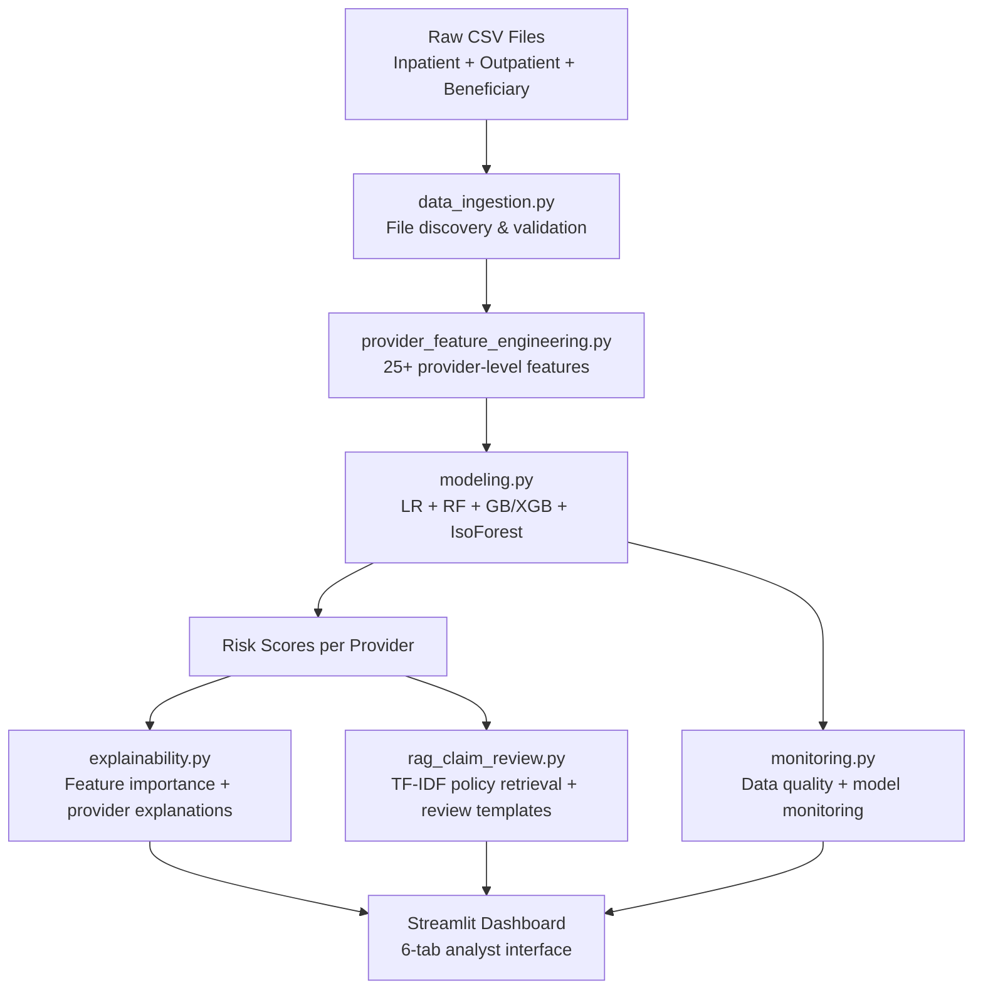

# Healthcare Provider FWA Risk Scoring & GenAI Review System

> A healthcare fraud, waste, and abuse analytics project using real public claims data
> combined with ML risk scoring and RAG-style provider review.

[](https://python.org)
[](https://scikit-learn.org)
[](https://streamlit.io)
[](https://github.com/bobaoxu2001/Insurance-FWA-Risk-Scoring-GenAI-Claims-Review-System/actions/workflows/ci.yml)

---

## 1. Project Overview

An end-to-end FWA analytics pipeline that:

- Ingests and joins the **Kaggle Healthcare Provider Fraud Detection Analysis** dataset
  (inpatient claims + outpatient claims + beneficiary demographics)
- Engineers **25+ provider-level risk features** (volume, reimbursement, physician patterns,
  chronic-condition complexity, inpatient ratio, admission duration, code diversity)
- Trains **Logistic Regression, Random Forest, Gradient Boosting / XGBoost, and Isolation
  Forest** models with class-imbalance handling
- Evaluates with ROC-AUC, PR-AUC, F1, and a full **threshold sweep** analysis
- Generates **provider-level SHAP / feature importance explanations**
- Produces **RAG-style provider audit review packets** using TF-IDF retrieval over
  synthetic healthcare billing audit rules
- Runs **model monitoring and data-quality checks** on the provider feature table
- Serves a **6-tab Streamlit dashboard** for executives and FWA analysts

**Fallback mode:** When Kaggle data is not available, the pipeline runs on a synthetic
5,000-claim dataset with a hidden latent fraud-intent variable (leakage-aware) — for
portability only; real headline metrics below come from the Kaggle dataset.

---

## 2. Real Dataset Results

Full pipeline run on the **Kaggle Healthcare Provider Fraud Detection Analysis** dataset (Train split):

| Source | Providers | Features | Fraud Rate |
|---|---|---|---|
| Train_Beneficiarydata | 138,556 beneficiaries | — | — |
| Train_Inpatientdata | 40,474 claims | — | — |
| Train_Outpatientdata | 517,737 claims | — | — |
| **Provider table (processed)** | **5,410 providers** | **27** | **9.35% (506 fraudulent)** |

**Model performance on held-out test set (80/20 stratified split):**

| Model | ROC-AUC | F1 | Recall | Precision |
|---|---|---|---|---|
| **Random Forest** ⭐ | **0.9535** | **0.6927** | **0.7030** | 0.6828 |
| Gradient Boosting | 0.9489 | 0.6413 | 0.5842 | 0.7115 |
| Logistic Regression | 0.9062 | 0.4821 | 0.8020 | 0.3447 |
| Isolation Forest | anomaly scoring | — | — | — |

**Top 5 features by Random Forest importance:**

| Rank | Feature | Importance |
|---|---|---|
| 1 | `max_admission_duration` | 0.144 |
| 2 | `total_reimbursed` | 0.134 |
| 3 | `total_deductible_amount` | 0.098 |
| 4 | `total_inpatient_reimbursed` | 0.075 |
| 5 | `inpatient_claim_count` | 0.062 |

> Metrics JSON (`outputs/reports/model_metrics.json`) is annotated with `"_data_source": "real_kaggle_provider"` so any consumer can verify which run produced the numbers.

---

## 3. Business Problem & FWA Context

> "How do we systematically identify which healthcare providers are billing anomalously —
> before we pay claims we can't recover — while protecting legitimate providers and
> maintaining audit explainability for regulators?"

Healthcare FWA (Fraud, Waste, and Abuse) costs the US healthcare system an estimated
$100B–$300B per year. Common provider-level FWA patterns include:

- **Upcoding:** billing a higher-acuity service (e.g. inpatient) than actually rendered
- **Unbundling:** splitting a single procedure into multiple separately-billed components
- **Phantom billing:** charging for services not rendered
- **Duplicate billing:** submitting the same service claim multiple times
- **Medically unnecessary services:** high reimbursement for treatments without clinical justification
- **Physician ID fraud:** billing under multiple physician NPIs to obscure patterns

---

## 4. Dataset

**Name:** Healthcare Provider Fraud Detection Analysis
**Source:** Kaggle (public educational dataset)
**URL:** https://www.kaggle.com/datasets/rohitrox/healthcare-provider-fraud-detection-analysis

### Data Disclaimer

> **IMPORTANT:** This dataset is a public educational resource only.
> - NOT Manulife data
> - NOT John Hancock data
> - NOT Long Term Care-specific claims data
> - No real patient records, clinical documents, or insurance company data
> - No PHI (Protected Health Information)
> - Synthetic text used for RAG demo purposes only

The dataset contains:
- **Beneficiary demographics:** DOB, DOD, chronic conditions (14 flags), race, state
- **Inpatient claims:** admission/discharge dates, reimbursement, deductible, attending/operating physicians, diagnosis & procedure codes
- **Outpatient claims:** same structure, without admission dates
- **Provider labels:** binary PotentialFraud flag (Yes/No) per provider

---

## 5. Why this is relevant to LTC FWA

The Kaggle dataset is **not** Long Term Care-specific — it covers Medicare-style
inpatient/outpatient claims. However, the analytical workflow transfers almost
directly to LTC FWA work:

- **Provider-level risk scoring.** LTC FWA programs review providers and facilities,
  not individual claims in isolation. The aggregation pattern here (claim → provider
  feature table → binary risk score) is the same shape an LTC program would use.
- **Reimbursement anomaly detection.** Outlier reimbursement, abnormal admission
  duration, and inpatient-billing ratio are exactly the signals LTC FWA analysts
  watch for in skilled-nursing and home-health billing.
- **Utilization patterns.** Unique beneficiaries served, physician diversity, and
  chronic-condition complexity translate directly into LTC member-mix and care-team
  composition checks.
- **Documentation / audit evidence.** The RAG-style review packet — risk indicators,
  retrieved policy citations, documentation gaps — mirrors the structured case file
  an LTC compliance / SIU reviewer assembles before acting on a flagged provider.
- **Human-in-the-loop review.** No automated payment hold; every HIGH flag is
  surfaced to a licensed analyst. This is the same operating model required for
  LTC fraud findings to hold up under regulator review.

In short: different claim taxonomy, same analytical scaffolding, same audit deliverable.

---

## 6. Why This Dataset

This is the closest freely-available public proxy for healthcare FWA analytics:

| Attribute | This dataset | Real-world FWA |
|---|---|---|
| Unit of analysis | Provider-level | Provider-level (most programs) |
| Label type | Binary fraud flag | Binary or scored |
| Claim types | Inpatient + Outpatient | Full continuum |
| Beneficiary data | Demographics + chronic conditions | Demographics + clinical |
| Physician data | Attending + Operating + Other | Full credentialing records |

---

## 7. Solution Architecture



---

## 8. Data Pipeline

```
data/raw/
    Train_Beneficiarydata-*.csv
    Train_Inpatientdata-*.csv
    Train_Outpatientdata-*.csv
    Train-*.csv  (provider labels)
         |
         v
src/data_ingestion.py        — find files, validate columns, load DataFrames
         |
         v
src/provider_feature_engineering.py
         — join inpatient + outpatient on BeneID to beneficiary
         — aggregate to provider level (25+ features)
         — attach fraud labels
         — save data/processed/provider_modeling_table.csv
         |
         v
src/modeling.py              — train + evaluate + save models
src/explainability.py        — feature importance + provider explanations
src/rag_claim_review.py      — generate 15 provider audit reviews
src/monitoring.py            — data quality + monitoring charts
```

---

## 9. Feature Engineering

Features engineered at provider level from joined inpatient/outpatient/beneficiary data:

**Volume features:**
- `total_claims`, `inpatient_claim_count`, `outpatient_claim_count`
- `inpatient_ratio` = inpatient / total
- `unique_beneficiaries`
- `claim_frequency_per_beneficiary`

**Physician features:**
- `unique_attending_physicians`, `unique_operating_physicians`, `unique_other_physicians`

**Financial features:**
- `total_inpatient_reimbursed`, `total_outpatient_reimbursed`, `total_reimbursed`
- `avg_reimbursed_per_claim`, `reimbursement_per_beneficiary`
- `total_deductible_amount`, `inpatient_reimbursement_share`

**Patient demographic features:**
- `avg_patient_age`, `std_patient_age`
- `death_rate` (fraction of patients with recorded death)
- `avg_chronic_conditions` (mean # chronic conditions per patient)

**Duration features** (inpatient only):
- `avg_admission_duration`, `max_admission_duration` (days)

**Code diversity features:**
- `diagnosis_code_diversity` (mean unique ICD codes per claim)
- `procedure_code_diversity` (mean unique CPT codes per claim)

**Risk / outlier features:**
- `provider_volume_percentile`
- `reimbursement_outlier_score` = z-score of avg reimbursement vs all providers

---

## 10. Modeling Approach

| Model | Notes |
|---|---|
| Logistic Regression | Baseline; class_weight=balanced |
| Random Forest | n_estimators=200; class_weight=balanced; max_depth=12 |
| Gradient Boosting / XGBoost | scale_pos_weight for imbalance; 200 trees |
| Isolation Forest | Unsupervised anomaly detection baseline |

Class imbalance is handled with `class_weight="balanced"` for supervised models and
`contamination=fraud_base_rate` for Isolation Forest.

---

## 11. Model Evaluation

Reported metrics on held-out test set (80/20 stratified split):

| Metric | Why it matters for FWA |
|---|---|
| ROC-AUC | Overall ranking quality across all thresholds |
| PR-AUC (Average Precision) | More informative than AUC under class imbalance |
| Precision @ threshold | False positive rate → analyst capacity |
| Recall @ threshold | Fraud catch rate → financial exposure |
| F1 @ threshold | Balanced summary |
| Threshold sweep table | Operations teams pick based on reviewer capacity |

See **Section 2 — Real Dataset Results** above for headline numbers from the Kaggle pipeline.

### Why Metrics Should Be Interpreted Carefully

- Kaggle labels have ~9.4% fraud rate at the provider level, with some label noise from aggregation
- Provider-level labels aggregate claim-level noise; edge cases are ambiguous
- Test set performance is not a guarantee of production performance
- Real LTC fraud detection would require domain-specific features, clinical context, compliance review, and ongoing model validation
- Isolation Forest AUC not reported (unsupervised; no predict_proba threshold calibration)

---

## 12. Explainability

- **Feature importance:** SHAP TreeExplainer (if available) or model `.feature_importances_`
- **Provider explanations:** for each high-risk provider, 3-5 business-readable bullets
  (e.g. "Avg reimbursement per claim is 3.2x the overall median")
- **Top risk factors:** `outputs/reports/top_risk_factors.csv`
- **Provider explanations:** `outputs/reports/high_risk_provider_explanations.csv`

---

## 13. RAG Provider Review Assistant

A TF-IDF retrieval system over `data/documents/policy_rules.txt` that:

1. Scores each provider with the trained model
2. Selects 10 HIGH + 3 MEDIUM + 2 LOW risk providers
3. Builds a natural-language query from the provider's risk indicators
4. Retrieves top-3 most relevant policy rule chunks (cosine similarity)
5. Renders a structured review packet including:
   - Provider ID, Risk Level, Model Risk Score
   - Key Risk Indicators (3-5 specific, quantified bullets)
   - Retrieved Policy / Audit Evidence
   - Data & Documentation Gaps
   - Suggested Analyst Action
   - Human Review Notes
   - System Limitations disclaimer

Reviews saved to `outputs/sample_reviews/review_{Provider}.txt`

---

## 14. Model Monitoring & Data Quality

`src/monitoring.py` produces:

| Output | Description |
|---|---|
| `data_quality_report.csv` | Column-level missing rates, n_unique, dtypes |
| `model_monitoring_report.csv` | Provider-level statistical summary per feature |
| `provider_risk_distribution.png` | Risk score distribution by fraud label |
| `reimbursement_distribution.png` | Reimbursement per claim with median / P99 |
| `fraud_rate_by_volume_bucket.png` | Fraud prevalence by provider volume quintile |
| `feature_missingness.png` | Missing rate per feature column |

---

## 15. Responsible AI & Auditability

- **Human-in-the-loop:** every HIGH risk flag surfaces to a human analyst before action
- **Quantified uncertainty:** model probability scores (not black-box flags)
- **Policy traceability:** each review cites the most relevant audit rule chunks
- **Data lineage:** data source clearly labeled (real Kaggle / synthetic demo)
- **Limitations logged:** every review includes a System Limitations section
- **No real PHI:** Kaggle dataset and synthetic documents only

---

## 16. Repository Structure

```
Insurance-FWA-Risk-Scoring-GenAI-Claims-Review-System/
├── src/
│   ├── data_generation.py              # Original synthetic data generation
│   ├── synthetic_data_generation.py    # Same, with synthetic-mode header
│   ├── data_ingestion.py               # Kaggle file discovery + loaders
│   ├── provider_feature_engineering.py # Provider-level feature table builder
│   ├── preprocessing.py                # Synthetic claim preprocessing
│   ├── feature_engineering.py          # Synthetic claim feature engineering
│   ├── modeling.py                     # ML training + evaluation (real or synthetic)
│   ├── explainability.py               # Feature importance + explanations
│   ├── rag_claim_review.py             # TF-IDF RAG review generator
│   ├── monitoring.py                   # Data quality + monitoring charts
│   └── utils.py
├── data/
│   ├── raw/                            # Place Kaggle CSVs here (see data/README.md)
│   ├── processed/                      # provider_modeling_table.csv / claims_features.csv
│   └── documents/                      # policy_rules.txt + synthetic claim docs
├── outputs/
│   ├── figures/                        # PNG charts
│   ├── models/                         # best_fwa_model.pkl, isolation_forest.pkl
│   ├── reports/                        # metrics JSON, threshold CSV, explanations
│   └── sample_reviews/                 # review_{ID}.txt files
├── notebooks/
├── app.py                              # Streamlit 6-tab dashboard
├── config.py                           # Path constants
├── requirements.txt
├── README.md
└── resume_bullets.md
```

---

## 17. How to Download the Data

1. Go to: https://www.kaggle.com/datasets/rohitrox/healthcare-provider-fraud-detection-analysis
2. Click **Download** (free Kaggle account required)
3. Unzip the downloaded archive
4. Place all CSV files in `data/raw/`
5. Verify: `python src/data_ingestion.py` — should print "All files loaded successfully"

---

## 18. How to Run

### Quick start with the Makefile

```bash
make install         # pip install -r requirements.txt
make real-pipeline   # full pipeline on real Kaggle data
make synthetic-demo  # fallback pipeline on synthetic data
make dashboard       # launch Streamlit dashboard
make test            # run pytest
```

### Run tests

```bash
pytest -q
```

### Full pipeline with real Kaggle data

```bash
# 1. Install dependencies
pip install -r requirements.txt

# 2. Place Kaggle CSV files in data/raw/  (see section 15)

# 3. Run pipeline
python src/data_ingestion.py                  # validate files
python src/provider_feature_engineering.py   # build provider feature table
python src/modeling.py                        # train + evaluate models
python src/explainability.py                  # feature importance + explanations
python src/rag_claim_review.py               # generate 15 sample reviews
python src/monitoring.py                      # monitoring charts + reports

# 4. Launch dashboard
streamlit run app.py
```

### Synthetic demo (no Kaggle download required)

```bash
pip install -r requirements.txt

python src/synthetic_data_generation.py      # generates synthetic_claims.csv
python src/preprocessing.py
python src/feature_engineering.py
python src/modeling.py
python src/explainability.py
python src/rag_claim_review.py
python src/monitoring.py

streamlit run app.py
```

---

## 19. Sample Outputs

- `outputs/reports/model_metrics.json` — ROC-AUC, F1, precision, recall per model
- `outputs/reports/threshold_analysis.csv` — full threshold sweep (0.05 → 0.95)
- `outputs/reports/top_risk_factors.csv` — top 20 features by importance
- `outputs/reports/high_risk_provider_explanations.csv` — provider-level risk bullets
- `outputs/sample_reviews/review_*.txt` — formatted RAG audit reviews
- `outputs/figures/roc_curve.png`, `precision_recall_curve.png`, `feature_importance.png`
- `outputs/figures/provider_risk_distribution.png`, `fraud_rate_by_volume_bucket.png`

---

## 20. Dashboard Screenshots

To regenerate the dashboard screenshots locally:

```bash
make dashboard            # or: streamlit run app.py
```

Then capture each of the following tabs and save to `outputs/figures/`:

| Tab | Suggested filename |
|---|---|
| Executive Overview | `outputs/figures/dashboard_executive_overview.png` |
| Model Performance | `outputs/figures/dashboard_model_performance.png` |
| High-Risk Provider Review Assistant | `outputs/figures/dashboard_provider_review.png` |

Screenshots are not committed by default to keep the repo light — capture and embed them locally if presenting.

---

## 21. Resume Bullets

**Short (3 bullets):**

- Built a provider-level healthcare FWA analytics pipeline using the public Kaggle Healthcare
  Provider Fraud Detection dataset, joining inpatient, outpatient, and beneficiary records to
  engineer 25+ provider risk features and train ML fraud detection models.
- Trained and evaluated Logistic Regression, Random Forest, Gradient Boosting/XGBoost, and
  Isolation Forest models on imbalanced provider fraud labels, reporting ROC-AUC, PR-AUC,
  precision/recall tradeoffs, and performing threshold sweep analysis.
- Developed a RAG-style provider review assistant using TF-IDF retrieval over synthetic audit
  policy rules to generate structured, auditable provider risk summaries supporting
  human-in-the-loop analyst workflows.

**Long (4 bullets):**

- Built an end-to-end healthcare provider FWA analytics pipeline using the Kaggle Healthcare
  Provider Fraud Detection Analysis dataset: ingested and joined inpatient, outpatient, and
  beneficiary CSVs; engineered 25+ provider-level features including reimbursement outlier
  scores, inpatient billing ratio, chronic condition complexity, admission duration, and
  diagnosis/procedure code diversity.
- Trained and evaluated Logistic Regression, Random Forest, Gradient Boosting/XGBoost, and
  Isolation Forest models with class-imbalance handling (balanced class weights, scale_pos_weight);
  produced ROC, PR curve, confusion matrix, and a threshold sweep table mapping precision/recall
  tradeoffs to analyst review capacity decisions.
- Built a RAG-style provider audit review assistant (TF-IDF + cosine similarity over synthetic
  healthcare billing policy rules) generating 15 structured review packets per run — each
  containing quantified risk indicators, retrieved policy citations, documentation gaps,
  suggested analyst actions, and a system limitations disclaimer.
- Implemented a monitoring module producing data quality reports, reimbursement distribution
  charts, fraud rate by volume bucket, and feature missingness plots; wrapped all outputs in
  a 6-tab Streamlit dashboard with graceful fallback to synthetic demo mode when real data
  is unavailable.

---

## 22. Resume GitHub Description

Healthcare provider FWA risk scoring: Kaggle claims data → 25+ features → ML models → RAG audit reviews → Streamlit dashboard

---

## 23. LinkedIn Featured Project

Built a healthcare provider fraud, waste & abuse (FWA) detection system using the public Kaggle Healthcare Provider Fraud Detection dataset. The pipeline joins inpatient, outpatient, and beneficiary records into a provider-level feature table (25+ features), trains ensemble ML models with class-imbalance handling, and generates RAG-style audit review packets via TF-IDF policy retrieval. A 6-tab Streamlit dashboard surfaces risk scores, model performance, threshold analysis, and structured provider reviews — designed for human-in-the-loop analyst workflows. Full pipeline runs with or without the Kaggle download (synthetic fallback mode included).

---

## 24. 30-Second Interview Pitch

"I built a healthcare provider fraud detection system using a public Kaggle dataset of inpatient,
outpatient, and beneficiary claims. The pipeline joins those three data sources and engineers
about 25 provider-level features — things like reimbursement outlier scores, inpatient billing
ratio, physician diversity, and chronic-condition complexity. I trained Random Forest, Gradient
Boosting, and Logistic Regression models and did a full threshold sweep to show the
precision/recall tradeoff. On top of the model, I built a RAG-style review system that retrieves
relevant billing audit rules via TF-IDF and generates structured, human-readable audit packets
for each high-risk provider. The whole thing runs in Streamlit with a graceful fallback to
synthetic data if the Kaggle download isn't available."

---

## 25. 2-Minute Interview Explanation (Manulife/John Hancock LTC FWA framing)

"The project addresses the same core challenge your LTC FWA team faces: given a large volume
of provider billing activity, how do you systematically identify which providers are billing
anomalously — before you pay claims you can't recover?

I used the Kaggle Healthcare Provider Fraud Detection Analysis dataset as a public proxy for
this problem. It's not LTC-specific, but it has the key structural elements: inpatient and
outpatient claims, beneficiary demographics with chronic conditions, physician identifiers,
and binary fraud labels at the provider level.

The feature engineering step joins three data sources and aggregates to the provider level —
computing things like average reimbursement per claim relative to peers, inpatient billing
ratio, unique beneficiaries served, and chronic condition complexity of the patient panel.
These are the kinds of signals a human FWA analyst would look for manually.

On the modeling side, I trained Random Forest and Gradient Boosting models with class-imbalance
handling, evaluated them on ROC, precision-recall curves, and a threshold sweep table. The
threshold sweep is important because the right operating point depends on how many reviewers
you have — you can tune precision versus recall based on capacity.

The RAG-style review assistant is designed for the human-in-the-loop layer: when a provider
scores HIGH, the system retrieves the most relevant billing audit rules via TF-IDF and generates
a structured packet — risk indicators, policy citations, documentation gaps, and suggested
analyst actions. This gives the analyst everything they need to make a decision efficiently,
without the model making the decision for them.

I built all of this with a clean fallback to synthetic data so it can be demonstrated without
proprietary data, and wrapped it in a Streamlit dashboard. The architecture mirrors what a
production FWA system would look like before adding real-time scoring and case management
integration."

---

## 26. What I Would Improve in a Real Insurance Environment

If this project were deployed into a real LTC FWA program rather than built on a public proxy, the next investments would be:

- **Real LTC claim notes and care-plan documentation.** Replace synthetic policy text with actual SOC documentation, plan-of-care narratives, and progress notes so the RAG layer can do clinical/contextual evidence retrieval rather than generic billing-rule matching.
- **Provider network / graph features.** Build referral graphs and shared-physician edges across providers; graph-based risk scoring catches collusive billing rings that provider-level features miss.
- **Temporal drift monitoring on rolling windows.** Move from a single train/test split to monthly retrains with PSI/KS drift alerts on feature distributions and score distributions.
- **Case management system integration.** Push HIGH-risk flags directly into the analyst's case queue with a structured payload (risk indicators, retrieved policy, prior dispositions for the same provider).
- **Fairness / compliance / bias review across protected attributes.** Audit score distributions across race, state, and age-band cohorts; document any disparate impact before deployment.
- **Reviewer feedback loop.** Capture analyst dispositions (confirmed fraud / cleared / needs more info) as labels for the next training cycle — this is what turns the model from a static classifier into a learning system.
- **Calibrated thresholds tuned to current analyst capacity.** Auto-adjust the operating threshold so flagged volume matches the rolling-window analyst headcount, instead of a fixed cutoff.

---

## 27. Limitations & Future Improvements

| Current limitation | Potential improvement |
|---|---|
| TF-IDF retrieval only | Add sentence-transformer embeddings for semantic search |
| No temporal modeling | Time-series billing sequences (weekly volume trends) |
| No graph features | Provider-beneficiary referral network analysis |
| No NLP on clinical text | Would require real EHR access |
| Static threshold | Dynamic threshold based on rolling reviewer capacity |
| Binary labels | Ordinal or multi-class fraud severity scoring |
| Train set only (Kaggle) | Cross-validate against held-out Test split |
