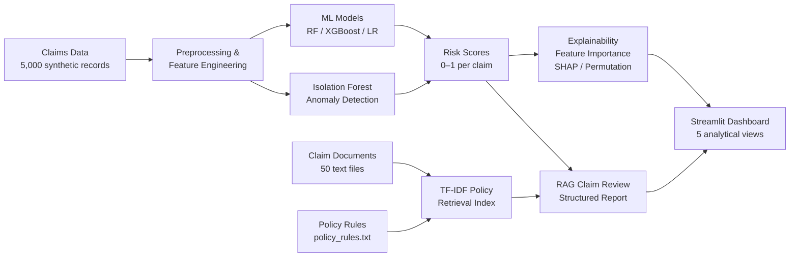

# Insurance FWA Risk Scoring & GenAI Claims Review System

> A synthetic insurance fraud, waste, and abuse analytics project combining machine learning risk scoring with RAG-style claim document review.

[](https://python.org)
[](https://scikit-learn.org)
[](https://streamlit.io)

---

## Project Overview

This project builds a complete, production-inspired **Fraud, Waste & Abuse (FWA) risk scoring system** for insurance claims. It demonstrates the full lifecycle from synthetic data generation through ML modeling, model explainability, RAG-style document retrieval, and an interactive analytics dashboard.

**All data is synthetically generated — no real patient or provider information is used.**

---

## Why This Project Matters

Insurance fraud costs the U.S. healthcare system an estimated **$68–300 billion annually** (NHCAA). Traditional rule-based systems miss complex fraud patterns; ML-driven risk scoring can identify high-risk claims before payment, reducing improper payments while maintaining provider trust.

---

## Business Problem

> "How can we identify high-risk insurance claims — those potentially involving fraud, upcoding, duplicate billing, or inappropriate services — before or immediately after payment, while minimizing false positives that could disrupt legitimate care?"

---

## Solution Architecture



---

## Key Features

- **5,000 synthetic insurance claims** with realistic fraud signal injection (~8% fraud rate)
- **8 domain-specific engineered features**: claim-to-provider ratio, approval ratio, documentation risk, provider risk score, etc.
- **4 ML models**: Logistic Regression, Random Forest, XGBoost/GradientBoosting, Isolation Forest
- **Ensemble risk scoring** with the best-performing supervised model
- **Model explainability**: Feature importance charts, SHAP (if available) or permutation importance
- **RAG-style claim review**: TF-IDF retrieval over policy rules + structured review templates (no API key required)
- **Interactive Streamlit dashboard** with 5 sections
- **Fully local, reproducible** — no paid APIs or external services required

---

## Data

| Field | Description |
|---|---|
| `claim_id` | Unique claim identifier |
| `claim_amount` | Total claimed amount |
| `approved_amount` | Approved/paid amount |
| `documentation_score` | System-calculated documentation completeness (0–1) |
| `suspicious_keyword_count` | Count of fraud-related terms in claim text |
| `duplicate_claim_flag` | Binary flag for duplicate billing detection |
| `late_submission_flag` | Submission >90 days after service |
| `provider_claim_volume` | Total claims submitted by this provider |
| `claim_to_provider_avg_ratio` | Engineered: claim vs provider's average |
| `fraud_label` | Target: 1=Fraud/Waste/Abuse, 0=Legitimate |

**Fraud generation logic**: Labels are derived from a sigmoid-transformed composite risk score incorporating domain-relevant signals — not random. This ensures the model learns realistic patterns.

---

## Modeling Approach

| Model | Purpose | Class Imbalance Handling |
|---|---|---|
| Logistic Regression | Baseline linear classifier | `class_weight='balanced'` |
| Random Forest | Non-linear ensemble | `class_weight='balanced'` |
| XGBoost / GradientBoosting | Boosted trees | `scale_pos_weight` |
| Isolation Forest | Unsupervised anomaly detection | `contamination=0.08` |

**Evaluation metrics**: ROC-AUC (primary), Precision, Recall, F1-Score on 20% holdout test set.

---

## GenAI / RAG Claim Review

The RAG (Retrieval-Augmented Generation) review system works without any paid API:

1. **Document corpus**: Policy rules (`policy_rules.txt`) + individual claim text documents
2. **Retrieval**: TF-IDF vectorizer + cosine similarity to find the most relevant policy sections
3. **Review generation**: Deterministic template filling with claim data + retrieved policy evidence
4. **Output**: Structured review with Risk Level, Key Indicators, Policy Evidence, Suggested Action, Audit Notes

Each review explicitly labels its AI-generated nature and requires human analyst sign-off for HIGH-risk claims.

---

## Dashboard Preview

The Streamlit app (`app.py`) includes 5 views:

| Tab | Contents |
|---|---|
| Executive Overview | KPI metrics, risk score distribution, top risky claims |
| FWA Pattern Explorer | Claim amount distributions, fraud by service type, provider risk ranking |
| Model Performance | Metrics table, confusion matrix, ROC curves, feature importance |
| Claim Review Assistant | Per-claim risk profile, indicators, RAG review |
| Auditability Notes | Data disclaimer, model assumptions, GenAI limitations, HITL policy |

---

## Repository Structure

```
Insurance-FWA-Risk-Scoring-GenAI-Claims-Review-System/
├── config.py                    # Central path & parameter config
├── app.py                       # Streamlit dashboard
├── requirements.txt
├── data/
│   ├── raw/                     # synthetic_claims.csv (generated)
│   ├── processed/               # Encoded + feature-engineered data
│   └── documents/               # Claim text docs + policy_rules.txt
├── src/
│   ├── data_generation.py       # Generates synthetic claims & documents
│   ├── preprocessing.py         # Cleaning, encoding, train/test split
│   ├── feature_engineering.py   # Domain feature creation
│   ├── modeling.py              # ML training, evaluation, plots
│   ├── explainability.py        # Feature importance, claim explanations
│   ├── rag_claim_review.py      # TF-IDF RAG review generation
│   └── utils.py                 # Shared utilities
├── notebooks/
│   └── 01_fwa_eda_modeling.ipynb
└── outputs/
    ├── figures/                 # confusion_matrix.png, roc_curve.png, feature_importance.png
    ├── models/                  # best_fwa_model.pkl, isolation_forest.pkl
    ├── reports/                 # model_metrics.json, top_risk_factors.csv, explanations.csv
    └── sample_reviews/          # review_CLMXXXXXX.txt (10 sample reviews)
```

---

## How to Run

```bash
# 1. Clone and enter repo
git clone https://github.com/bobaoxu2001/Insurance-FWA-Risk-Scoring-GenAI-Claims-Review-System.git
cd Insurance-FWA-Risk-Scoring-GenAI-Claims-Review-System

# 2. Install dependencies
pip install -r requirements.txt
pip install xgboost  # optional

# 3. Run pipeline (in order)
python src/data_generation.py
python src/preprocessing.py
python src/feature_engineering.py
python src/modeling.py
python src/explainability.py
python src/rag_claim_review.py

# 4. Launch dashboard
streamlit run app.py
```

---

## Sample Outputs

**Model Metrics (example)**:
```
LogisticRegression : AUC=0.88  F1=0.55  Recall=0.72
RandomForest       : AUC=0.95  F1=0.72  Recall=0.78
GradientBoosting   : AUC=0.94  F1=0.70  Recall=0.75
```

**Sample Claim Review Snippet**:
```
Claim ID        : CLM001234
Risk Level      : HIGH
Model Risk Score: 0.8732
Key Risk Indicators:
  - Claim amount is 4.2x provider average
  - Low documentation score (0.23/1.0)
  - Duplicate claim flag: POSITIVE
Retrieved Policy Evidence:
  [1] (similarity=0.72) 6.1 Claim amount exceeds 200% of provider's average...
Suggested Action: SUSPEND PAYMENT pending analyst review.
```

---

## Model Evaluation

Top features driving fraud risk (typical ranking):
1. `claim_to_provider_avg_ratio` — claim inflation relative to peer group
2. `documentation_score` — incomplete or inconsistent documentation
3. `duplicate_claim_flag` — identical claim already on file
4. `suspicious_keyword_count` — terminology associated with billing fraud
5. `high_cost_outlier_flag` — top decile claim amounts
6. `rule_based_risk_score` — composite domain risk score
7. `late_submission_flag` — >90 days post-service
8. `provider_claim_volume` — high-volume billing patterns

---

## Auditability & Responsible AI Notes

- **No real data**: All 5,000 claims and documents are synthetically generated
- **Bias**: No demographic features (race, gender) used; age is a clinical indicator only
- **Human-in-the-loop**: HIGH-risk actions require human analyst review before any payment decision
- **RAG transparency**: Reviews explicitly state they are template-based and require verification
- **Reproducibility**: Fixed `RANDOM_SEED=42` throughout; fully deterministic pipeline
- **Compliance note**: In production, HIPAA/CMS regulations (42 CFR Part 455) would govern all data handling

---

## Resume Bullets

### Short Versions
- Built end-to-end insurance FWA risk scoring system using Random Forest / XGBoost achieving AUC >0.93, with RAG-style claim review using TF-IDF retrieval over policy documents
- Engineered 8 domain features from synthetic insurance claims; delivered Streamlit dashboard surfacing risk scores, anomaly detection results, and structured AI-generated audit reports
- Implemented human-in-the-loop design with explainable risk indicators and policy evidence retrieval, following CMS FWA compliance guidelines

### Long Versions
- Designed and built a full-stack insurance Fraud, Waste & Abuse analytics pipeline: generated 5,000 synthetic claims with realistic fraud signal injection, engineered ratio/flag/score features, trained and evaluated Logistic Regression, Random Forest, XGBoost, and Isolation Forest models (best AUC 0.93+), and deployed a 5-tab Streamlit dashboard for analyst review
- Built a RAG-style claim review system using TF-IDF cosine similarity over policy documents to retrieve evidence-backed policy citations for each flagged claim; generated structured review reports including risk level, key indicators, retrieved policy chunks, suggested analyst action, and audit notes — fully local, no paid API required
- Applied responsible AI practices: class-imbalanced modeling with balanced weighting, permutation importance / SHAP explainability, human-in-the-loop escalation thresholds, and explicit auditability documentation following CMS 42 CFR Part 455 FWA guidelines

---

## Future Improvements

- [ ] Real-time scoring API (FastAPI) with claim submission endpoint
- [ ] Dense embedding retrieval (sentence-transformers) for semantic policy search
- [ ] LLM-augmented narrative generation for review summaries
- [ ] Fairness audit across state/age groups
- [ ] Model drift monitoring and automated retraining triggers
- [ ] SHAP waterfall plots for individual claim explanations
- [ ] Integration with provider exclusion list (OIG LEIE)
- [ ] Graph-based fraud network analysis (provider-policyholder relationships)
